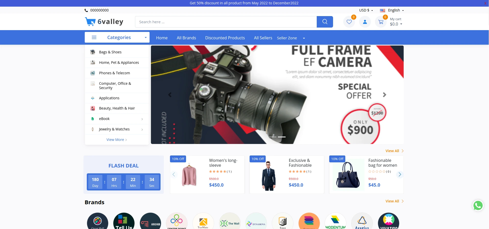
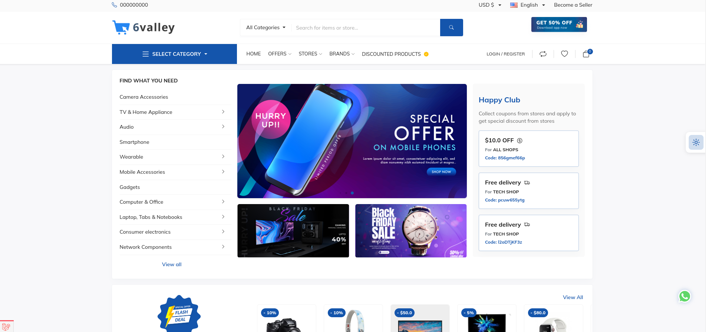
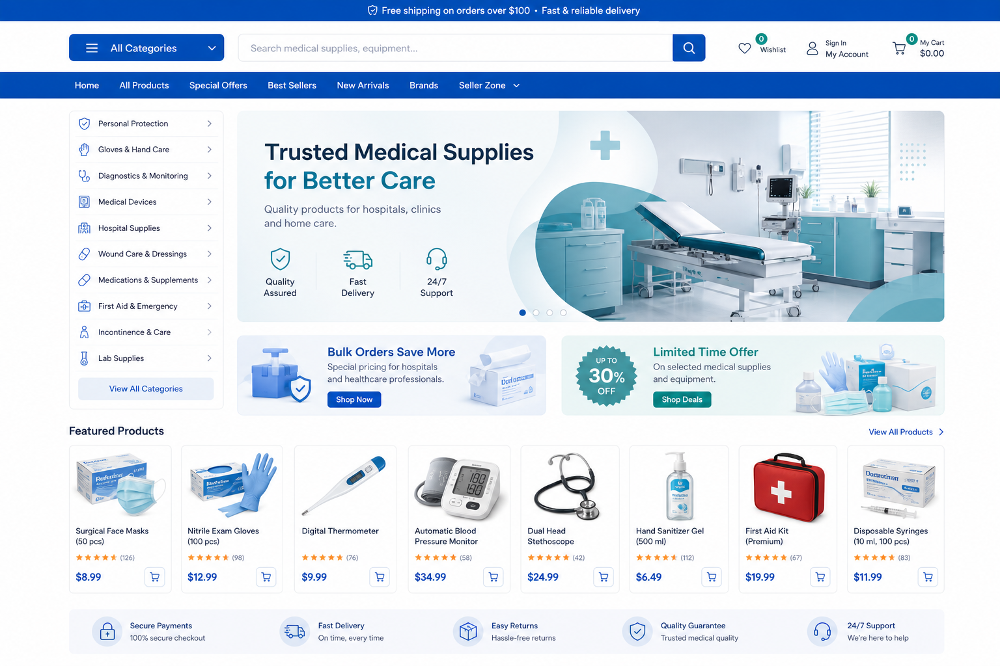
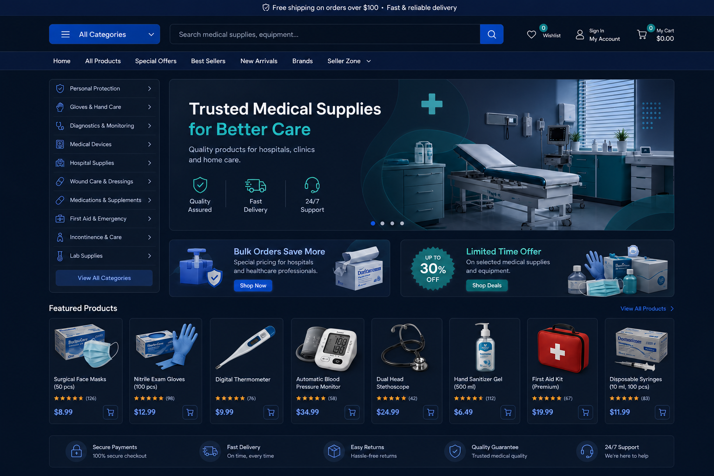
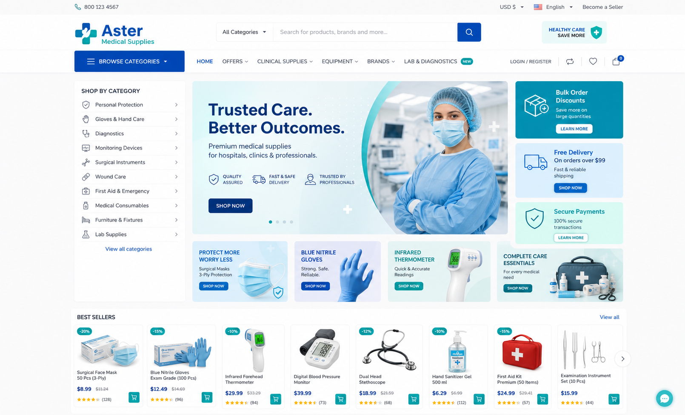
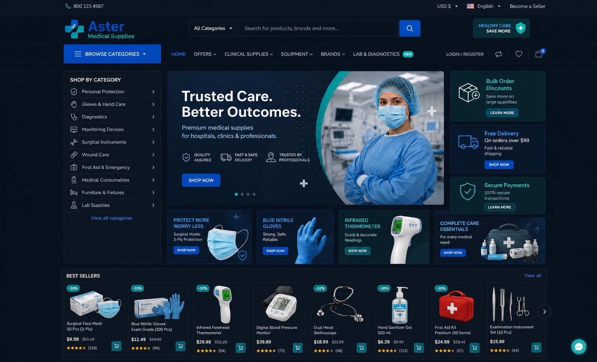

# معاينات الثيمات — متجر مستلزمات طبية

هذه معاينات بصرية تجريبية لواجهتي المنصة مع بيانات ومنتجات طبية وهمية. لا تضيف الصور أي منتجات أو أقسام أو بيانات إلى قاعدة البيانات؛ الغرض منها مقارنة شكل كل ثيم قبل التنفيذ الفعلي.

## صور الثيمين الأصلية من الموقع

هذه هي صور المعاينة الأصلية الموجودة بالفعل في ملفات المنصة قبل إدخال محتوى المستلزمات الطبية.

### الثيم الافتراضي الأصلي

### ثيم Aster الأصلي

## الثيم الافتراضي

### الوضع الفاتح

### الوضع الداكن

يعرض هذا الخيار تخطيط متجر تقليدي: شريط تصنيفات جانبي، بانر رئيسي واسع، عروض أفقية، ثم بطاقات منتجات واضحة.

## ثيم Aster

### الوضع الفاتح

### الوضع الداكن

يعرض هذا الخيار تخطيطًا أكثر تسويقيًا: قائمة تصنيفات ثابتة، بانر رئيسي، بطاقات عروض جانبية، وعروض للمنتجات في صف واحد.

## عناصر العرض التجريبية

- كمامات جراحية، قفازات نيتريل، مقياس حرارة، جهاز قياس ضغط، سماعة طبية، معقم يدين، حقيبة إسعافات وأدوات فحص.
- بانرات طبية بألوان الأزرق والتركواز، مناسبة للمستلزمات الطبية والعيادات.
- في النسخ الداكنة استخدمت أسطحًا كحلية ودرجات رمادية داكنة ونصوصًا فاتحة، من دون مساحات بيضاء أو حدود حادة.

## ملفات الصور

| الثيم | الوضع | الملف |
|---|---|---|
| الافتراضي | المعاينة الأصلية من الموقع | `theme-medical-previews/default-theme-original.webp` |
| Aster | المعاينة الأصلية من الموقع | `theme-medical-previews/aster-theme-original.png` |
| الافتراضي | فاتح | `theme-medical-previews/default-medical-light.png` |
| الافتراضي | داكن | `theme-medical-previews/default-medical-dark.png` |
| Aster | فاتح | `theme-medical-previews/aster-medical-light.png` |
| Aster | داكن | `theme-medical-previews/aster-medical-dark.png` |
